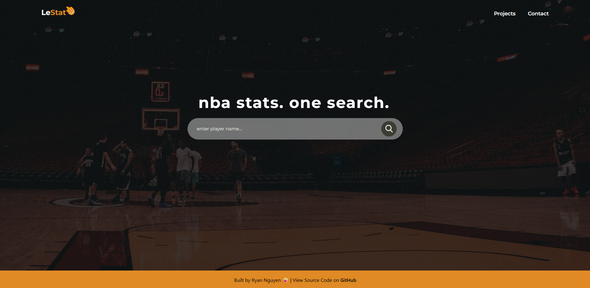
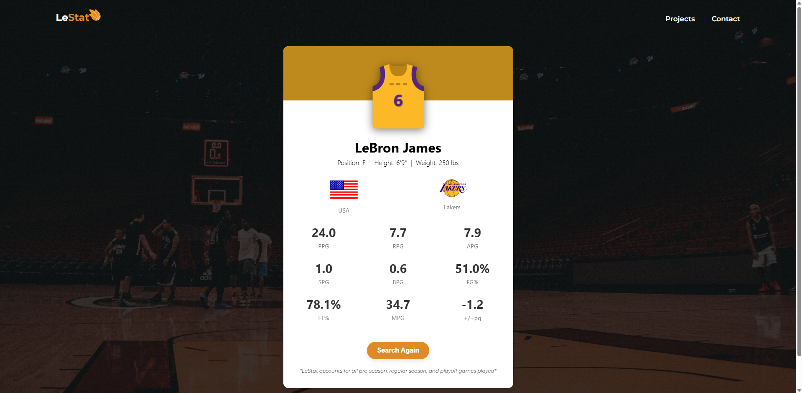
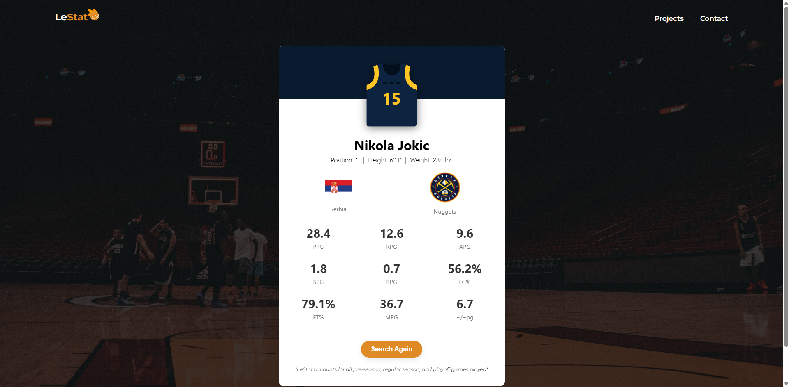
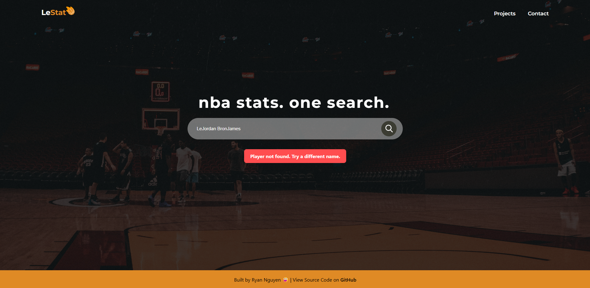

# LeStat
---
A responsive React app that allows users to search for current NBA players and view their statistics, jersey, team, and more in one stylish card.

## Languages/Tools
---
- **Frontend:** JavaScript(React), HTML, CSS
- **REST API:** [RapidAPI NBA API](https://rapidapi.com/api-sports/api/api-nba)
- **Icons & Assets:** Flag icons via [FlagsAPI](https://flagsapi.com)

## Key Features
---
- 🔍 Real-time player search
- 📊 Season stats (PPG, RPG, APG, etc.) for all pre-season, regular season, and playoff games
- 👕 Dynamic team jersey display with player number
- 🏳️ Country flag and team logo
- 🎨 Responsive, modern card layout
- 🔁 Refresh/Search Again functionality
- ⚠️ Inline error messages with smooth transitions

## Technical Breakdown
---
- API Integration & Data Handling: Connected to the NBA API via RapidAPI to fetch player data, stats, and team info. Aggregated game-level data to compute season averages (e.g. PPG, FG%, plus-minus) and handled dynamic JSON parsing for structured rendering.
- Component-Based Architecture: Designed the app using reusable React components (SearchBar, PlayerInfo, StatsCard, etc.) with a focus on separation of concerns, prop-driven design, and dynamic rendering based on fetched data.
- Responsive & Interactive UI: Styled with Flexbox, Grid, and media queries to ensure a smooth experience across screen sizes. Added fade-in card animations, typing header effects, and dynamic error banners for improved UX.
- Visual Enhancements: Integrated custom SVG jerseys tailored to each NBA team, team logos, and national flags using a team and country mapping system. Ensured visual consistency and alignment across components for both desktop and mobile.

